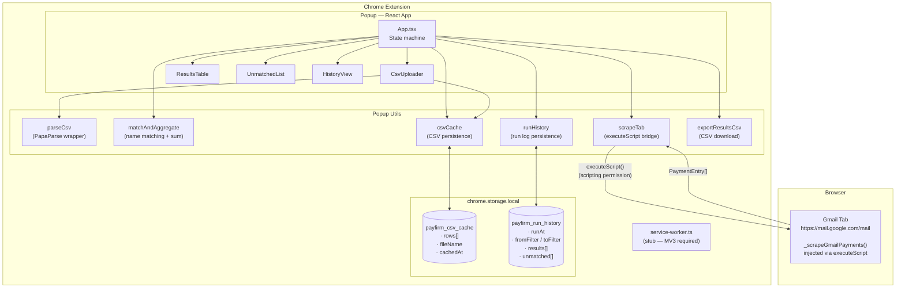
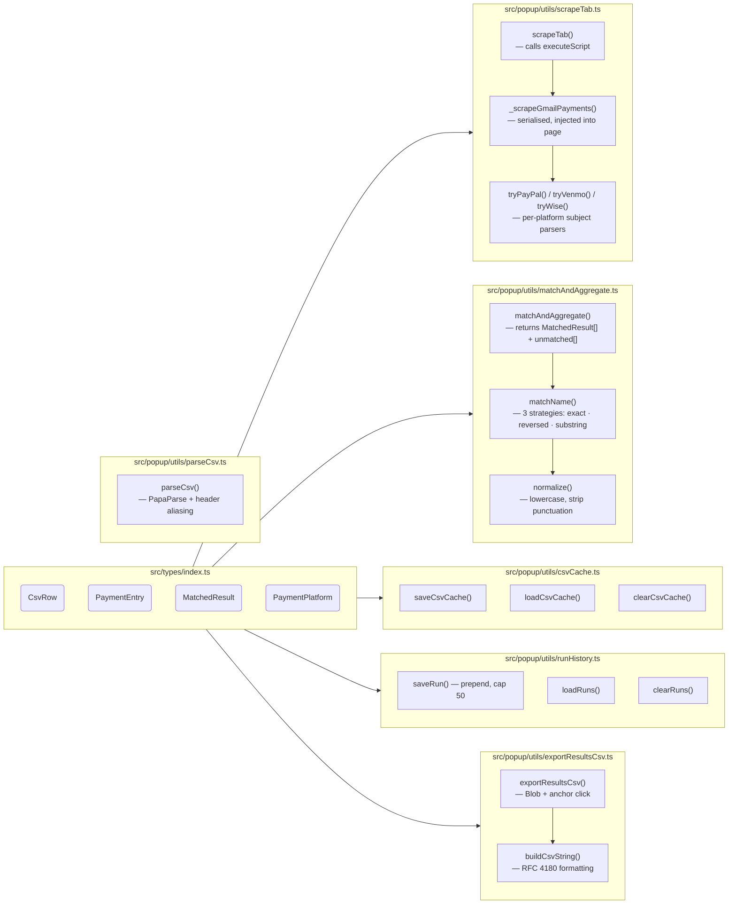
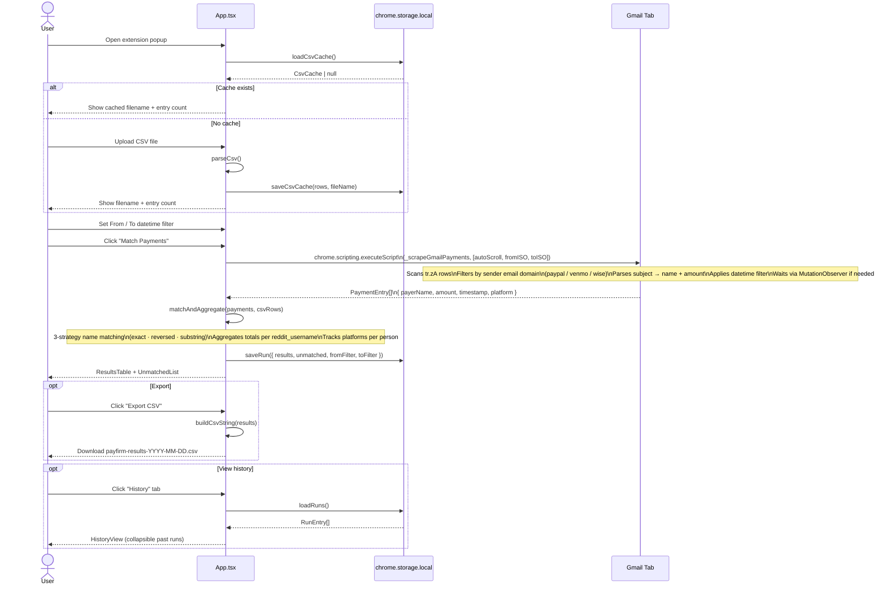
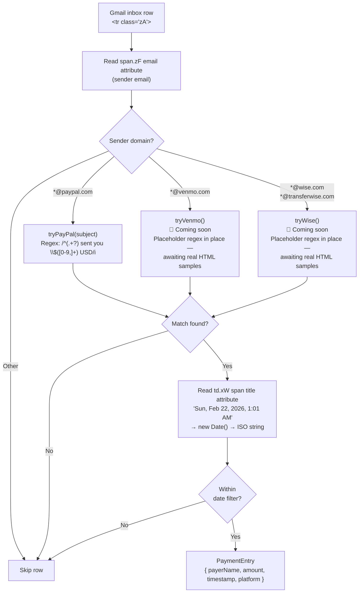
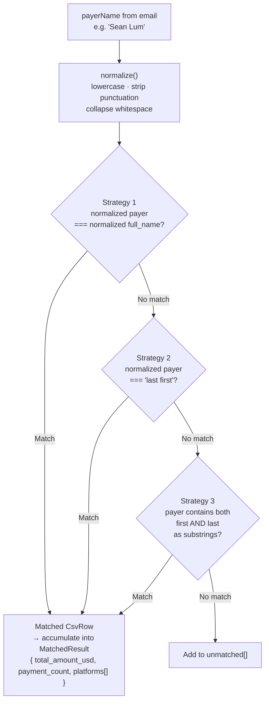
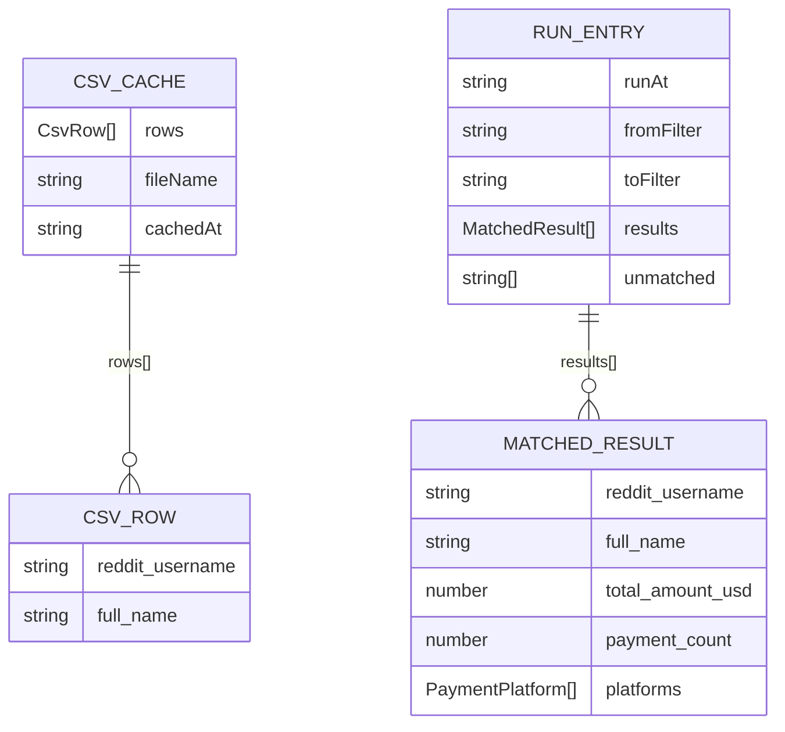

# Payfirm — Architecture

> **Platform support status**
> | Platform | Status |
> |----------|--------|
> | PayPal | ✅ Fully implemented |
> | Venmo | 🚧 Coming soon — awaiting HTML element samples to finalise selectors and subject regex |
> | Wise | 🚧 Coming soon — awaiting HTML element samples to finalise selectors and subject regex |

---

## 1. System Overview

High-level view of all extension components and their relationships to the browser and external storage.

---

## 2. Component Breakdown

Internal structure of every module and what it owns.

---

## 3. User Journey — Sequence Diagram

End-to-end flow for a typical session: open popup → scrape → export.

---

## 4. Scraping Pipeline — Gmail → PaymentEntry

How a raw Gmail inbox row becomes a typed `PaymentEntry`.

---

## 5. Name Matching Strategy

How `matchAndAggregate` links a payer name to a CSV entry.

---

## 6. Storage Schema

What lives in `chrome.storage.local` and its shape.

