# Payfirm — Architecture

> **Platform support status**
> | Platform | Status |
> |----------|--------|
> | PayPal | ✅ Fully implemented |
> | Venmo | 🚧 Coming soon — awaiting HTML element samples to finalise selectors and subject regex |
> | Wise | 🚧 Coming soon — awaiting HTML element samples to finalise selectors and subject regex |

---

## 1. System Overview

High-level view of all extension components and their relationships to the browser and external storage.

```mermaid
graph TB
    subgraph ext[Chrome Extension]
        direction TB

        subgraph popup[Popup — React App]
            App["App.tsx\nState machine"]
            CsvUploader
            ResultsTable
            UnmatchedList
            HistoryView
        end

        subgraph utils[Popup Utils]
            parseCsv["parseCsv\n(PapaParse wrapper)"]
            matchAndAggregate["matchAndAggregate\n(name matching + sum)"]
            scrapeTab["scrapeTab\n(executeScript bridge)"]
            csvCache["csvCache\n(CSV persistence)"]
            runHistory["runHistory\n(run log persistence)"]
            exportResultsCsv["exportResultsCsv\n(CSV download)"]
        end

        subgraph storage[chrome.storage.local]
            CSVStore[("payfirm_csv_cache\n· rows[]\n· fileName\n· cachedAt")]
            RunStore[("payfirm_run_history\n· runAt\n· fromFilter / toFilter\n· results[]\n· unmatched[]")]
        end

        BG["service-worker.ts\n(stub — MV3 required)"]
    end

    subgraph browser[Browser]
        Gmail["Gmail Tab\nhttps://mail.google.com/mail\n\n_scrapeGmailPayments()\ninjected via executeScript"]
    end

    App --> CsvUploader & ResultsTable & UnmatchedList & HistoryView
    App --> scrapeTab & matchAndAggregate & exportResultsCsv & csvCache & runHistory
    CsvUploader --> parseCsv & csvCache
    csvCache <--> CSVStore
    runHistory <--> RunStore
    scrapeTab -- "executeScript()\n(scripting permission)" --> Gmail
    Gmail -- "PaymentEntry[]" --> scrapeTab
```

---

## 2. Component Breakdown

Internal structure of every module and what it owns.

```mermaid
graph LR
    subgraph types["src/types/index.ts"]
        T1(CsvRow)
        T2(PaymentEntry)
        T3(MatchedResult)
        T4(PaymentPlatform)
    end

    subgraph scraper["src/popup/utils/scrapeTab.ts"]
        S1["_scrapeGmailPayments()\n— serialised, injected into page"]
        S2["scrapeTab()\n— calls executeScript"]
        S3["tryPayPal() / tryVenmo() / tryWise()\n— per-platform subject parsers"]
        S1 --> S3
        S2 --> S1
    end

    subgraph matching["src/popup/utils/matchAndAggregate.ts"]
        M1["normalize()\n— lowercase, strip punctuation"]
        M2["matchName()\n— 3 strategies: exact · reversed · substring"]
        M3["matchAndAggregate()\n— returns MatchedResult[] + unmatched[]"]
        M3 --> M2 --> M1
    end

    subgraph csv["src/popup/utils/parseCsv.ts"]
        P1["parseCsv()\n— PapaParse + header aliasing"]
    end

    subgraph cache["src/popup/utils/csvCache.ts"]
        C1["saveCsvCache()"]
        C2["loadCsvCache()"]
        C3["clearCsvCache()"]
    end

    subgraph history["src/popup/utils/runHistory.ts"]
        H1["saveRun() — prepend, cap 50"]
        H2["loadRuns()"]
        H3["clearRuns()"]
    end

    subgraph exporter["src/popup/utils/exportResultsCsv.ts"]
        E1["buildCsvString()\n— RFC 4180 formatting"]
        E2["exportResultsCsv()\n— Blob + anchor click"]
        E2 --> E1
    end

    types --> scraper & matching & cache & history & exporter
```

---

## 3. User Journey — Sequence Diagram

End-to-end flow for a typical session: open popup → scrape → export.

```mermaid
sequenceDiagram
    actor User
    participant Popup as App.tsx
    participant Storage as chrome.storage.local
    participant Gmail as Gmail Tab

    User->>Popup: Open extension popup

    Popup->>Storage: loadCsvCache()
    Storage-->>Popup: CsvCache | null

    alt Cache exists
        Popup-->>User: Show cached filename + entry count
    else No cache
        User->>Popup: Upload CSV file
        Popup->>Popup: parseCsv()
        Popup->>Storage: saveCsvCache(rows, fileName)
        Popup-->>User: Show filename + entry count
    end

    User->>Popup: Set From / To datetime filter
    User->>Popup: Click "Match Payments"

    Popup->>Gmail: chrome.scripting.executeScript\n(_scrapeGmailPayments, [autoScroll, fromISO, toISO])

    note over Gmail: Scans tr.zA rows\nFilters by sender email domain\n(paypal / venmo / wise)\nParses subject → name + amount\nApplies datetime filter\nWaits via MutationObserver if needed

    Gmail-->>Popup: PaymentEntry[]\n{ payerName, amount, timestamp, platform }

    Popup->>Popup: matchAndAggregate(payments, csvRows)
    note over Popup: 3-strategy name matching\n(exact · reversed · substring)\nAggregates totals per reddit_username\nTracks platforms per person

    Popup->>Storage: saveRun({ results, unmatched, fromFilter, toFilter })
    Popup-->>User: ResultsTable + UnmatchedList

    opt Export
        User->>Popup: Click "Export CSV"
        Popup->>Popup: buildCsvString(results)
        Popup-->>User: Download payfirm-results-YYYY-MM-DD.csv
    end

    opt View history
        User->>Popup: Click "History" tab
        Popup->>Storage: loadRuns()
        Storage-->>Popup: RunEntry[]
        Popup-->>User: HistoryView (collapsible past runs)
    end
```

---

## 4. Scraping Pipeline — Gmail → PaymentEntry

How a raw Gmail inbox row becomes a typed `PaymentEntry`.

```mermaid
flowchart TD
    A["Gmail inbox row\n&lt;tr class='zA'&gt;"] --> B["Read span.zF email attribute\n(sender email)"]
    B --> C{Sender domain?}

    C -- "*@paypal.com" --> D["tryPayPal(subject)\nRegex: /^(.+?) sent you \\$([0-9,]+) USD/i"]
    C -- "*@venmo.com" --> E["tryVenmo()\n🚧 Coming soon\nPlaceholder regex in place —\nawaiting real HTML samples"]
    C -- "*@wise.com\n*@transferwise.com" --> F["tryWise()\n🚧 Coming soon\nPlaceholder regex in place —\nawaiting real HTML samples"]
    C -- "Other" --> G["Skip row"]

    D & E & F --> H{Match found?}
    H -- No --> G
    H -- Yes --> I["Read td.xW span title attribute\n'Sun, Feb 22, 2026, 1:01 AM'\n→ new Date() → ISO string"]

    I --> J{Within\ndate filter?}
    J -- No --> G
    J -- Yes --> K["PaymentEntry\n{ payerName, amount, timestamp, platform }"]
```

---

## 5. Name Matching Strategy

How `matchAndAggregate` links a payer name to a CSV entry.

---

## 6. Storage Schema

What lives in `chrome.storage.local` and its shape.

